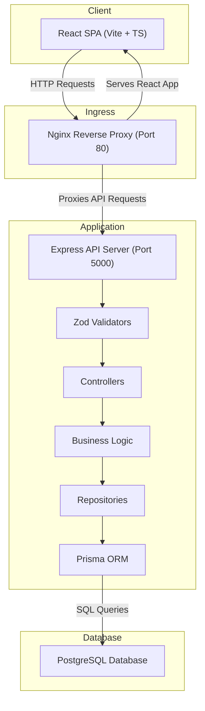
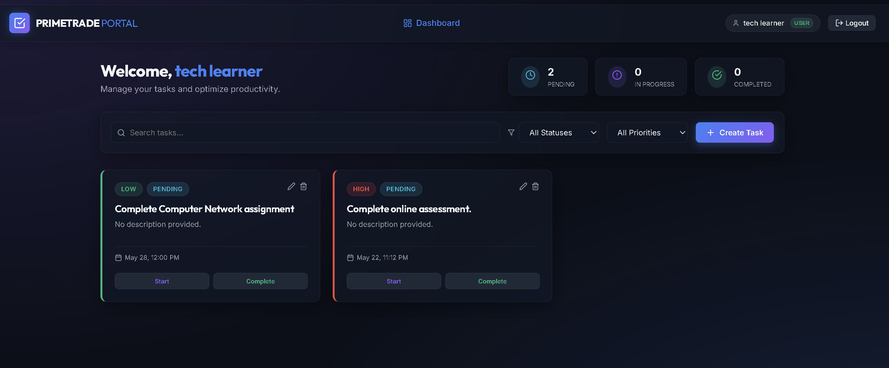
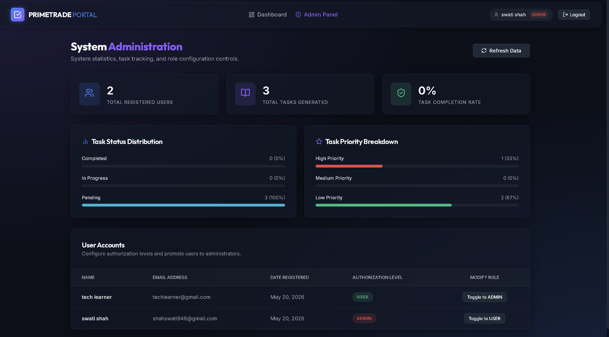

Your README is breaking because of a few Markdown syntax issues:

* The Mermaid code block is not closed properly with triple backticks.
* The `graph TD` section is incomplete.
* Some headings and lists are accidentally inside the Mermaid block.
* A few formatting inconsistencies exist (`onauth` → `on auth`, spacing issues, etc.).

Here’s the corrected final README you can directly paste into `README.md`:

````markdown
# Scalable REST API with RBAC & React Portal

This repository contains a production-grade implementation of the Backend Developer Intern assignment for Primetrade.ai. It features a secure, type-safe REST API built with Node.js, TypeScript, and Express, utilizing Prisma ORM, and paired with a premium glassmorphic React dashboard frontend.

---

## 🚀 Key Features

### 🔒 Core Backend (Primary Focus)

- **Clean Layered Architecture:** Decouples the transport layer (Controllers), input validators (Zod Schemas), database layers (Repositories), and core business logic (Services).
- **Stateless Authentication:** Implements JWT access token authentication with secure password hashing (`bcryptjs` with 12 salt rounds).
- **Role-Based Access Control (RBAC):** Restricts endpoints using a variadic middleware pipeline (`USER` vs `ADMIN`).
- **IDOR (Insecure Direct Object Reference) Mitigation:** Ensures users can only mutate/view tasks they own by deriving query scopes directly from cryptographically verified JWT claims.
- **OpenAPI Explorer:** Integrates Swagger UI hosted directly by the server at `/api/v1/docs`.
- **Database Portability:** Uses Prisma ORM, configured for PostgreSQL in containerized environments and easily fallback-able to SQLite for zero-setup local development.

### 💻 Responsive Frontend (Supportive)

- **Vite + React + TypeScript:** Built with TypeScript for complete type safety.
- **Premium UI/UX:** Styled using pure Vanilla CSS with custom properties (CSS variables). Features glassmorphic cards, neon glows, responsive grid structures, dark-mode styling, and micro-animations.
- **Secure Session Context:** Centralized `AuthContext` managing tokens and user states with request/response interceptors to attach tokens automatically and clear sessions on expiry (`401`).
- **Admin Dashboard Panel:** Accessible only to admins, showing system-wide statistics (aggregates) and a user roles configuration controller.

---

## 🛠️ Tech Stack

### Backend
- Node.js
- TypeScript
- Express.js
- Prisma ORM
- PostgreSQL (Docker)
- SQLite (Local)

### Frontend
- React.js (Vite)
- TypeScript
- Axios
- Lucide Icons
- Vanilla CSS

### DevOps & Infrastructure
- Docker
- Docker Compose
- Nginx

---

## 📁 Directory Structure

```text
primetrade-assignment/
├── package.json
├── README.md
├── docker-compose.yml
├── backend/
│   ├── src/
│   │   ├── config/
│   │   ├── constants/
│   │   ├── controllers/
│   │   ├── middlewares/
│   │   ├── repositories/
│   │   ├── services/
│   │   ├── utils/
│   │   ├── validators/
│   │   ├── routes/
│   │   └── server.ts
│   ├── prisma/
│   ├── Dockerfile
│   └── package.json
└── frontend/
    ├── src/
    │   ├── components/
    │   ├── context/
    │   ├── layouts/
    │   ├── pages/
    │   ├── services/
    │   ├── App.tsx
    │   └── index.css
    ├── Dockerfile
    ├── nginx.conf
    └── package.json
```

---

## ⚡ Quick Start: Running the Project

### Method 1: Using Docker (Recommended, PostgreSQL-backed)

Ensure Docker Desktop and Docker Compose are installed.

Run from the root directory:

```bash
docker compose up --build
```

### Services

- **Frontend Dashboard:** `http://localhost`
- **Backend API:** `http://localhost:5000/api/v1`
- **Swagger Docs:** `http://localhost:5000/api/v1/docs`

> [!TIP]
> The first registered user is automatically promoted to the `ADMIN` role for initial platform management access.

---

## 💻 Method 2: Running Locally (SQLite-backed)

### 1. Backend Setup

Navigate into backend:

```bash
cd backend
```

Install dependencies:

```bash
npm install
```

Create `.env`:

```bash
copy .env.example .env
```

Update `prisma/schema.prisma`:

```prisma
datasource db {
  provider = "sqlite"
  url      = env("DATABASE_URL")
}
```

Update `.env`:

```env
DATABASE_URL="file:./dev.db"
```

Run migrations:

```bash
npx prisma migrate dev --name init
```

Start backend:

```bash
npm run dev
```

---

### 2. Frontend Setup

Open another terminal:

```bash
cd frontend
```

Install dependencies:

```bash
npm install
```

Start frontend:

```bash
npm run dev
```

Frontend runs on:

```text
http://localhost:5173
```

---
## 🏗️ Systems Architecture



## 📸 Screenshots & Previews

### 💻 Modern Dark-Mode Task Dashboard

Visual representation of the user task dashboard featuring glassmorphism UI panels and neon highlights.



---

### 📊 Admin Analytics Panel

Administrative dashboard displaying system statistics and user role management.



## 🔒 Security Architecture

### 1. Password Cryptography
Passwords are hashed using `bcrypt` with a cost factor of `12` before database insertion.

### 2. Defensive Headers
Uses `Helmet` middleware to protect against:
- Clickjacking
- MIME sniffing
- XSS vulnerabilities

### 3. Brute Force Protection
Rate limiting applied on authentication routes:
- `100 requests / 15 minutes`

### 4. Validation & Sanitization
All request payloads are validated through Zod schemas before reaching the service layer.

### 5. IDOR Mitigation
The backend never trusts `userId` values from request payloads. Ownership is always derived from verified JWT claims.

---

## 📈 Scalability Write-up

### 1. PostgreSQL Read Replicas & Connection Pooling

#### Problem
Heavy read traffic can bottleneck database performance.

#### Solution
- Primary node handles writes
- Read replicas handle task listings and analytics
- PgBouncer manages efficient connection pooling

---

### 2. Redis Caching Layer

#### Problem
Repeated reads increase database load.

#### Solution
Implement Cache-Aside pattern:
- Query Redis first
- Fallback to PostgreSQL on cache miss
- Cache responses with TTL
- Invalidate cache on task mutation

---

### 3. Horizontal Scaling with Load Balancing

#### Problem
Node.js applications are single-threaded.

#### Solution
- Deploy multiple backend containers
- Use Nginx or HAProxy for load balancing
- Apply Round-Robin or Least-Connections routing

---

### 4. Async Background Processing

#### Problem
Heavy operations block request-response cycles.

#### Solution
Use RabbitMQ or Kafka:
- API publishes async jobs
- Workers consume messages independently
- API immediately returns `202 Accepted`

Examples:
- Email notifications
- Analytics generation
- CSV/PDF exports
- Audit logging

---

## ✅ Assignment Highlights

- JWT Authentication
- RBAC Authorization
- Prisma ORM
- Swagger/OpenAPI Docs
- Dockerized Infrastructure
- Secure Middleware Stack
- Clean Architecture
- Production-grade Frontend
- PostgreSQL + SQLite Support
- Nginx Reverse Proxy
- Scalable System Design
````
